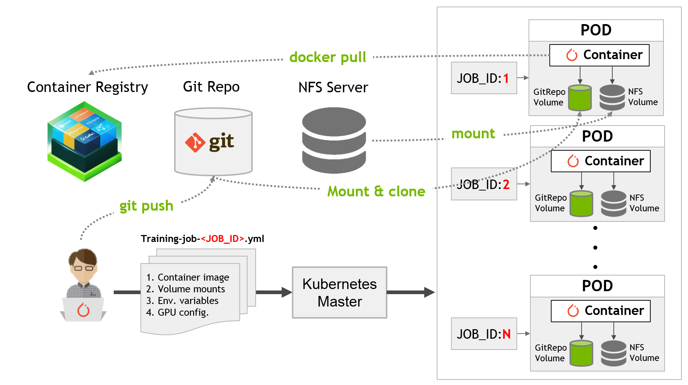

# Kubernetes for hyperparameter search experiments

This repository contains code and config files that accompany the following blog post: **[Kubernetes for AI Hyperparameter Search Experiments](https://devblogs.nvidia.com/kubernetes-ai-hyperparameter-search-experiments)**

Tested on Kubernetes version 1.10.11
Install guide: https://docs.nvidia.com/datacenter/kubernetes/kubernetes-install-guide/index.html

Hyperparameters for a machine learning model are options not optimized or learned during the training phase. Hyperparameters typically include options such as learning rate schedule, batch size, data augmentation options and others. Each option greatly affects the model accuracy on the same dataset. Two of the most common strategies for selecting the best hyperparameters for a model are grid search and random search. In the grid search method  (also known as the parameter sweep method) you define the search space by enumerating all possible hyperparameter values and train a model on each set of values. Random search only select random sets of values sampled from the exhaustive set. The results of each training run are then validated against a separate validation set.

A large body of literature exists discussing hyperparameters optimization. Other more sophisticated approaches can be used, such as bayesian optimization. However, when starting from scratch, random search and grid search are still the best approaches to narrow down the search space. 

The challenge with grid search and random search is that introducing more than a few hyperparameters and options quickly results in a combinatorial explosion. Add to this the training time required for each hyperparameter set and the problem quickly becomes intractable. Thankfully, this is also an embarrassingly parallel problem since each training run can be performed independently of others.

This repository includes kubernetes specification files and training scripts for running running large-scale hyperparameter search experiments using Kubernetes on a GPU cluster as shown in the figure below.
The framework is flexible and allows you to do grid search or random search and implements “version everything” so you can trace back all previously run experiments.

The training script is a modified version of the submission by [David Page](https://github.com/davidcpage/cifar10-fast/tree/d31ad8d393dd75147b65f261dbf78670a97e48a8) on the [Stanford’s DAWNBench webpage](https://dawn.cs.stanford.edu/benchmark/CIFAR10/train.html). The key modifications include changes to the training script that allow it ot accept hyperparameters by reading them from yaml spec. file.

Assuming you’ve already started by setting up a Kubernetes cluster, our solution for running hyperparameter search experiments consists of the following 7 steps:

1. Specify hyperparameter search space
2. Develop a training script that can accept hyperparameters and apply them to the training routine
3. Push training scripts and hyperparameters in a Git repository for tracking
4. Upload training and test dataset to a network storage such as NFS server
5. Specify Kubernetes Job specification files in YAML
6. Submit multiple Kubernetes job requests using above specification template
7. Analyze the results and pick the hyperparameter set

